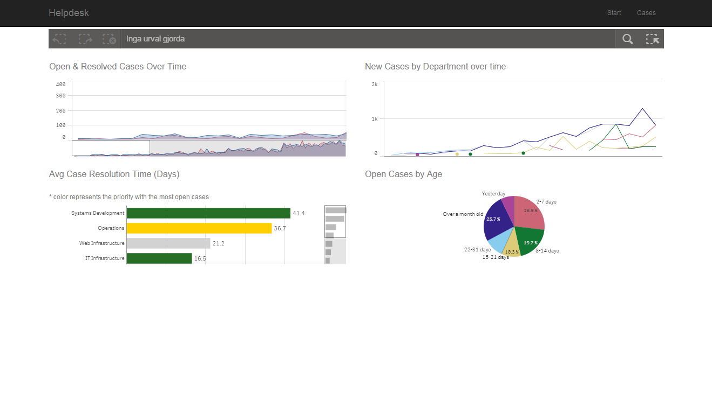

# Angular based mashup

Uses the Helpdesk Management app, so that needs to be imported. Start page shows some visualizations from the app, second page displays a list of cases, using an angular template. Angular ngRoute is used for page navigation.

## Using qlik in an angular app

Qlik Sense uses Angularjs internally, and from Qlik Sense 2.0 you can also use angularjs in your Qlik Sense mashup. To make it work you need to do the following:

### In the HTML file:

- add qva-bootstrap="false" to your HTML tag. This is to tell qlik sense not to automatically bootstrap the document

- include CSS file and require.js just like in any qlik sense mashup

- DO NOT include angular. Qlik sense will load angular

- DO NOT use the data-main tag of the requirejs link

### In the javascript file:

- create your angular module like in any angular app

- when your module is created you need to bootstrap angular with the method angular.bootstrap( document, ["myApp", "qlik-angular"] )

- make sure to include the module qlik-angular when you bootstrap

- you cannot use qlik sense API until after you have bootstrapped angular

